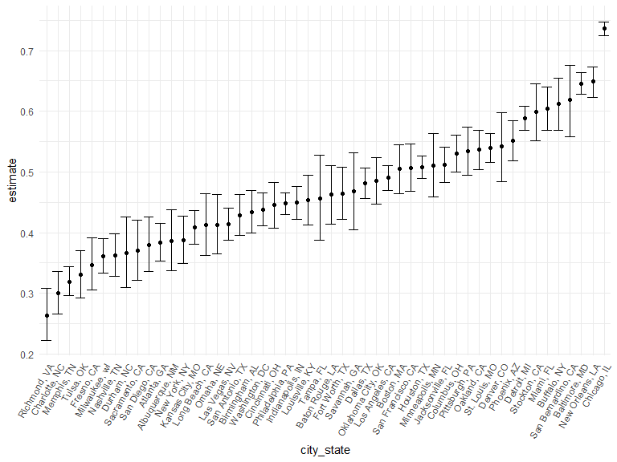

p8105_hw5_yl4924
================
Yongzheng Li
2022-11-16

# Problem 2

### Load and clean the data

``` r
url <- "https://raw.githubusercontent.com/washingtonpost/data-homicides/master/homicide-data.csv"
homicide_data <- read_csv(url) %>% 
  janitor::clean_names() %>% 
  mutate(
    state = case_when(state == "AL" & city == "Tulsa" ~ "OK",
                      TRUE                            ~ state)) %>%
  unite("city_state", c(city, state), sep = ", ", remove = FALSE)
```

    ## Rows: 52179 Columns: 12
    ## ── Column specification ────────────────────────────────────────────────────────
    ## Delimiter: ","
    ## chr (9): uid, victim_last, victim_first, victim_race, victim_age, victim_sex...
    ## dbl (3): reported_date, lat, lon
    ## 
    ## ℹ Use `spec()` to retrieve the full column specification for this data.
    ## ℹ Specify the column types or set `show_col_types = FALSE` to quiet this message.

The raw data-homicide_data included homicide cases over the past decade
in 50 of the largest American cities. The dataset contain 52179 rows and
13 columns. the important variable include reproted_date, victim_race,
victim_age, victim_sex, city, state, and disposition. When cleaning
data, there is one rows has city in Tulsa but state in AL. I changed
this row from “AL” to “OK” to make the dataset consistent.

### summarize table of total number of homicide and totoal number of unsolved homicide

``` r
homicide_city_count <- 
  homicide_data %>% 
  mutate(
    unsolved = disposition %in% c("Open/No arrest", "Closed without arrest")
  ) %>%  
  group_by(city_state) %>% 
  summarize(total_n = n(), 
            unsolved_n = sum(disposition %in% c("Open/No arrest", "Closed without arrest")))
head(homicide_city_count)
```

    ## # A tibble: 6 × 3
    ##   city_state      total_n unsolved_n
    ##   <chr>             <int>      <int>
    ## 1 Albuquerque, NM     378        146
    ## 2 Atlanta, GA         973        373
    ## 3 Baltimore, MD      2827       1825
    ## 4 Baton Rouge, LA     424        196
    ## 5 Birmingham, AL      800        347
    ## 6 Boston, MA          614        310

### prop test for city of Baltimore, MD

``` r
homicide_city_count %>% 
  filter(city_state == "Baltimore, MD") %>%
  mutate(
  output = map2(.x = unsolved_n, .y = total_n, ~prop.test(.x, .y))
  )
```

    ## # A tibble: 1 × 4
    ##   city_state    total_n unsolved_n output 
    ##   <chr>           <int>      <int> <list> 
    ## 1 Baltimore, MD    2827       1825 <htest>

``` r
balti_count <- homicide_city_count %>% 
  filter(city_state == "Baltimore, MD")
res <- prop.test(
    x = balti_count %>% pull(unsolved_n),
    n = balti_count %>% pull(total_n)) %>% 
  broom::tidy() %>% 
  select(estimate, conf.low, conf.high)
```

### prop test for each city

``` r
test <- homicide_city_count %>% 
  mutate(
    prop_test = map2(.x = unsolved_n, .y = total_n, ~prop.test(.x, .y)),
    prop_test = map(prop_test, broom::tidy)) %>%
  unnest(prop_test) %>% 
  select(city_state, unsolved_n, total_n, estimate, conf.low, conf.high)
```

### plot for estimate and CI for each city

``` r
test %>% 
  mutate(
    city_state = forcats::fct_reorder(city_state, estimate)) %>% 
  ggplot(aes(x = city_state, y = estimate)) + 
  geom_point() +
  geom_errorbar(aes(ymin = conf.low, ymax = conf.high)) +
  theme(axis.text.x = element_text(angle = 60, hjust = 1))
```



# Problem 3
